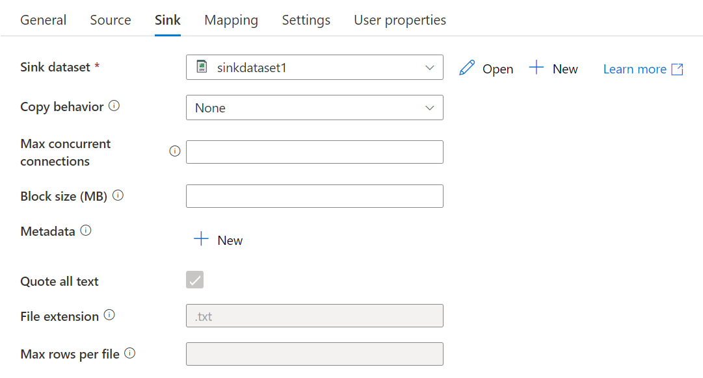
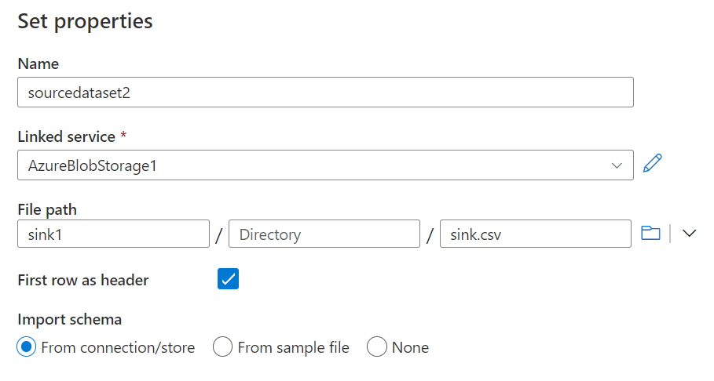
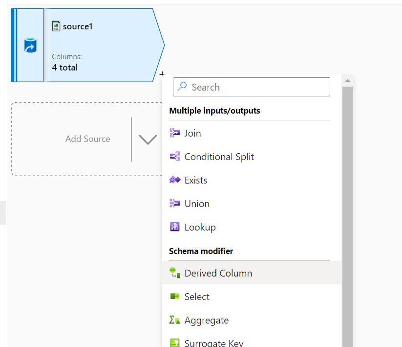
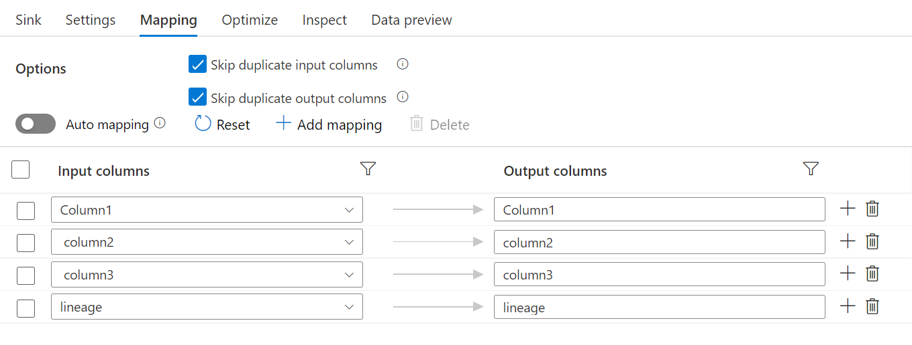
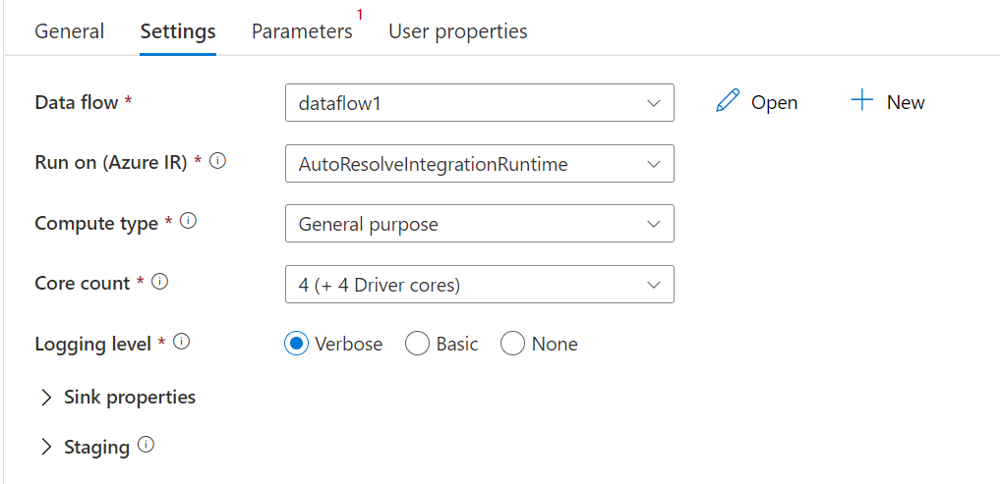
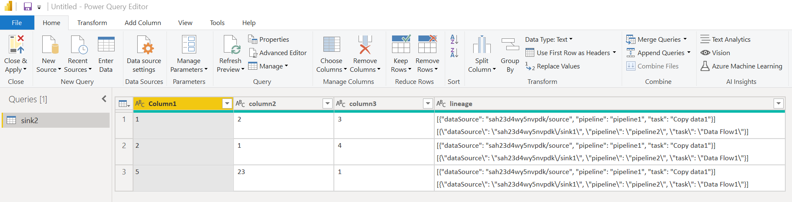

# Data Lineage

**Produced by Dave Lusty**

## Introduction

This is a demo showing you a simple way to create and store data lineage information. While a product such as Apache Atlas can allow you to centralise this information it does by necessity add some complexity and infrastructure as well as the associated operating costs of running the solution. The technique shown here does have some limitations, but it can offer a very simple way to get lineage information into your data, it doesn't rely on any specific tools or products, and the information is accessible and readable in any tool you can access your data from. Because it doesn't require connectors or APIs this can be applied directly to every row of your data right where it's processed.

There is a [video of this demo (no video yet)](https://youtu.be/S5kxhPDQaxs)

The demo will begin with a simple CSV file with a couple of rows of data. We will copy this in an "ingest" pipeline and add source information in a lineage column. Next we will copy the data in a "processing" pipeline which will convert to Parquet format and add some information to the lineage column.

### Resources

Needless to say, if you store a large text column on every row of data your data will become larger and processing will take longer. This trade off will be different in different scenarios. In uncompressed CSV you'll see a large increase in size, while compressed Parquet won't show much increase since every row will have almost identical data meaning it compresses very well with columnar compression techniques. While adding in a row does add processing time, if you're already processing the data then the increase should only be slight. If you're currently doing a binary file copy then this may slow the copy but the trade off of recording the source might be worth it in your use-case. 
In any event, this technique gives you another option in your toolkit.

### Data Structure

In this demo we will be using a JSON formatting in the lineage data column. Unfortunately due to the various technologies and formats I cannot give you full guidance on what to use and where because not all strings will be supported in all file formats. The JSON used here is an array of objects, allowing a new row to be added every time the row of data is processed. With the CSV format we start with we cannot add a new line to the JSON, and so if you wish to add multiple records to a CSV you might need to contrive some other format, or use character escaping to work around the limitations. Note that some tools like Data Factory sometimes escape characters for you when writing data so test your tools to determine what escaping is required with your data. Once in a more structured binary format we are more free to support full JSON. Please do not feel limited by standard formatting here, your lineage column is your own and as long as your processes can read and write it then it's OK. A simple text field delimited by full stops would be acceptable in some instances while full JSON in others. If you intend end users to read this data then make sure it's encoded and documented in an appropriate way.

#### JSON Arrays of Objects

A JSON array of objects can be used for simplicity since it is not complex to read or write. A JSON array would require you to add an object to an array and deal with commas etc. while an array of objects you just append one line. The format is as below:

```JSON
["objectName": "object1", "textField": "text", "numericField": 3]
["objectName": "object2", "textField": "text2", "numericField": 4]
```

Compare this with the more complex JSON array:

```JSON
[
    "objects": [
        {
            "objectName": "object1",
            "textField": "text",
            "numericField": 3
        },
        {
            "objectName": "object2",
            "textField": "text2",
            "numericField": 4
        }
    ]
]
```

These contain the same data, but the latter requires a comma between objects, but not after the last object, and requires correct closing of brackets. This is complex to process while the array of objects is very simple to add new lines.

#### Schema

You are completely free to form a structure to suit your lineage requirements. My advice here is to spend as little time as you can developing a schema. JSON is exceptionally flexible and will allow you to add in new fields at any time in the future without causing failure with existing information. You can add different columns within different entries if needed and these can be interpreted at the time of reading back the information. Treat this as a NoSQL store, not as a 3NF database.

As a good start I recommend the following information be recorded:

processingDate: the date on which the pipeline started. Avoid trying to record datetimes on a per row basis as this is very compute heavy.
dataSource: the source of the data from the perspective of this pipeline. The ultimate source will be at the top of the lineage, and we want to see where it goes along the way. This could be a JSON array if multiple sources are being merged.
pipeline: this is a unique identifier for your pipeline. This could be its name or some other way to see what process touched the data.
task: the task within the pipeline if you have multiple tasks processing the same data.
pipelineRunID: if you have a unique ID for the pipeline run this might be useful to record.
pipelineVersion: if you have good versioning this can be useful but is not essential.

```JSON
[
    {"dataSource": "sourceBlob", "pipeline": "pipeline1"}
    ]
```

## Infrastructure

For this demo we will be using Azure Data Factory and a storage account. 

Deploy the infrastructure required for this workshop by clicking the button below:

<a href="https://portal.azure.com/#create/Microsoft.Template/uri/https%3A%2F%2Fraw.githubusercontent.com%2Fdavedoesdemos%2FDataLineage%2Fmain%2Finfrastructure%2Fazuredeploy.json" target="_blank">
    
    </a>


## Setup

<table>
<tr>
<td width="60%">Once you've deployed the infrastructure to your subscription you will end up with a storage account and a data factory. Click on the storage account to begin.</td>
<td width="40%"></td>
</tr>
<tr>
<td width="60%">Next, click on Blob Service.</td>
<td width="40%"></td>
</tr>
<tr>
<td width="60%">Click on New Container, we'll need to do this three times for the source, sink, and second sink. In your real pipelines you may not use a single account for this, but for the demo this is easy to see.</td>
<td width="40%"></td>
</tr>
<tr>
<td width="60%">Create a container called "source" to house the source data we'll upload later.</td>
<td width="40%"></td>
</tr>
<tr>
<td width="60%">Create a container called "sink1". This will house the output of the initial copy, often referred to as "raw" storage.</td>
<td width="40%"></td>
</tr>
<tr>
<td width="60%">Create a container called "sink2". This will house the "processed" data which will be in Parquet format.</td>
<td width="40%"></td>
</tr>
<tr>
<td width="60%">Once your containers are created, click on your source container and then click Upload on the menu.</td>
<td width="40%"></td>
</tr>
<tr>
<td width="60%">Download the example data from <a href="https://github.com/davedoesdemos/DataLineage/blob/main/assets/data.csv">this link</a> and then browse for that file to upload. You now have a file in your source container with three lines of CSV data. It's a very simple file just for demo purposes.<br />
<br />
"Column1","column2","column3"<br />
1, 2, 3<br />
2, 1, 4<br />
5, 23, 1<br />
</td>
<td width="40%"></td>
</tr>
<tr>
<td width="60%">Next, browse to your data factory in the portal. Click "Open Azure Data Factory Studio" to open the data factory interface.</td>
<td width="40%"></td>
</tr>
<tr>
<td width="60%">Click Manage on the menu (you may need to expand this menu on the left to see the text)</td>
<td width="40%"></td>
</tr>
<tr>
<td width="60%">On Linked Services, click New to add the link to your storage account.</td>
<td width="40%"></td>
</tr>
<tr>
<td width="60%">Select Azure Blob Storage from the list.</td>
<td width="40%"></td>
</tr>
<tr>
<td width="60%">Give your linked service a name or accept the default, then browse for your account and storage account. The demo account will be names "sa" followed by some random letters and numbers. Test the link and then create it to finish.</td>
<td width="40%"></td>
</tr>
<tr>
<td width="60%">Next click on Author to begin creating the pipeline.</td>
<td width="40%"></td>
</tr>
<tr>
<td width="60%">Click the plus sign and select Dataset to create your two initial datasets.</td>
<td width="40%"></td>
</tr>
<tr>
<td width="60%">Select Azure Blog Storage as the dataset type.</td>
<td width="40%"></td>
</tr>
<tr>
<td width="60%">Next, choose Delimited Text as the type since both of these datasets will be CSV.</td>
<td width="40%"></td>
</tr>
<tr>
<td width="60%">Name the first dataset sourceDataset and choose first row as header from connection/store. This will allow data factory to read in the header row from the file.</td>
<td width="40%"></td>
</tr>
<tr>
<td width="60%">Browse for the data.csv file under the source container in your storage account.</td>
<td width="40%"></td>
</tr>
<tr>
<td width="60%">Repeat this process for the sink dataset to be called sinkDataset1. For this one you will need to type the filename since the file doesn't yet exist. Check the first row as header box, but choose none since the headers cannot yet be read from the file.</td>
<td width="40%"></td>
</tr>
<tr>
<td width="60%">Now click the plus again and choose Pipeline to create your pipeline.</td>
<td width="40%"></td>
</tr>
<tr>
<td width="60%">On the menu drag a copy data task onto the designer. This will copy data from your source to your sink dataset.</td>
<td width="40%"></td>
</tr>
<tr>
<td width="60%">On the source tab, use the dropdown to select your sourceDataset</td>
<td width="40%"></td>
</tr>
<tr>
<td width="60%">
At the bottom of this tab, add an additional column and call it lineage. This will house your lineage data going forwards. Needless to say, check your data doesn't have a column with this name already. In the example I used this text:<br />
<code>[{"dataSource": "sah23d4wy5nvpdk/source", "pipeline": "pipeline1", "task": "Copy data1"}]</code><br />
Change this to reflect your storage account name, pipeline name, and copy task name.
</td>
<td width="40%"></td>
</tr>
<tr>
<td width="60%">On the sink tab select your sinkDataset1.</td>
<td width="40%"></td>
</tr>
<tr>
<td width="60%">Now you're ready to run the copy task. We're running this now to create an output file so that we can read the schema from the header row. This is easier than manually creating the schema in code and is a useful shortcut as well as testing what you've created so far. Click Publish all on the menu to publish your task</td>
<td width="40%"></td>
</tr>
<tr>
<td width="60%">Check and acknowledge what will be published.</td>
<td width="40%"></td>
</tr>
<tr>
<td width="60%">Now create a trigger and choose trigger now to run the pipeline immediately. This will copy the data, add in the new column, and place the result in your sink1 container.</td>
<td width="40%"></td>
</tr>
<tr>
<td width="60%">Go to your sink1 container and check the file. Notice that your JSON has been escaped by the process so that double quotes have a forward slash character next to them. Commas are within quotes and so need no further escaping.The source data is otherwise untouched.</td>
<td width="40%"></td>
</tr>
<tr>
<td width="60%">Next we're going to create another pipeline which consumes this output. I decided to do this as a separate pipeline for clarity but as usual you may do this differently in your production systems I've used data flows here which is Spark based, but you could just as easily do this with code in any Spark engine like Databricks, or any other tool you're using. In the authoring pane of data factory add two new data sets. The first is sourceDataset2 and points to the sink1 container and the data.csv file created in the last step. This time, read the header row from connection/source which will give us a schema.</td>
<td width="40%"></td>
</tr>
<tr>
<td width="60%">For the second dataset we're going to choose Parquet as the format since it's binary and is very common in data lake applications. It can also be read by Power BI so your end users could use it to read this data in to a report.</td>
<td width="40%"></td>
</tr>
<tr>
<td width="60%">Call this sinkDataset2 and select none for the schema. Store it in your sink2 container but do not give it a file name.</td>
<td width="40%"></td>
</tr>
<tr>
<td width="60%">Next, click add and choose to create a data flow.</td>
<td width="40%"></td>
</tr>
<tr>
<td width="60%">Click to add a source to the data flow.</td>
<td width="40%"></td>
</tr>
<tr>
<td width="60%">Choose your sourceDataset2</td>
<td width="40%"></td>
</tr>
<tr>
<td width="60%">Now click the plus next to your source task and add a Derived Column task. This will create a column based on the existing lineage column and add our new information. In other tools you may just concatenate the existing column.</td>
<td width="40%"></td>
</tr>
<tr>
<td width="60%">Add a column called lineage. Using the same name is fine here since data flows can refer to either one based on the stream it came from. In our example we won't need both so will just refer to the output from this derived column task. Click the expression builder link under the expression box (you'll need to click the box to see this link)</td>
<td width="40%"></td>
</tr>
<tr>
<td width="60%">In the expression builder we'll be adding a line to the JSON array:<br />
<code>[{"dataSource": "sah23d4wy5nvpdk/sink1", "pipeline": "pipeline2", "task": "Data Flow1"}]</code><br />
We do this by concatenating a newline and the text, and also escaping the text as JSON. What you do here will depend on your own data and use case.<br />
<code>concat(concat(lineage, "\n"), escape('[{"dataSource": "sah23d4wy5nvpdk/sink1", "pipeline": "pipeline2", "task": "Data Flow1"}]','json'))</code></td>
<td width="40%"></td>
</tr>
<tr>
<td width="60%">Now click the plus on derived column and add a sink task.</td>
<td width="40%"></td>
</tr>
<tr>
<td width="60%">Choose your sinkdataset2 to write out the data. The incoming stream must be derivedColumn1, if it's the source dataset you will not get the additional data in the lineage column.</td>
<td width="40%"></td>
</tr>
<tr>
<td width="60%">On the mapping tab you'll see the mappings coming from the derived column task.</td>
<td width="40%"></td>
</tr>
<tr>
<td width="60%">Now create a new pipeline in the authoring pane of data factory and add in a data flow task to run your data flow.</td>
<td width="40%"></td>
</tr>
<tr>
<td width="60%">Select the data flow you created.</td>
<td width="40%"></td>
</tr>
<tr>
<td width="60%">Click to publish your changes including the new pipeline and data flow.</td>
<td width="40%"></td>
</tr>
<tr>
<td width="60%">Once the publish is complete trigger the new pipeline and wait for it to complete.</td>
<td width="40%"></td>
</tr>
<tr>
<td width="60%">Once complete you will see a new Parquet file in your sink2 container.</td>
<td width="40%"></td>
</tr>
<tr>
<td width="60%">If you open this file in Power BI you'll see the lineage column as JSON data so that end users can see how the data has been processed at every step.</td>
<td width="40%"></td>
</tr>
</table>
